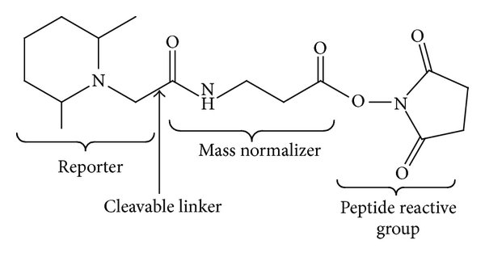

## Use case: Exploring changes in protein abundance across stages of the cell cycle

As a use case, we will analyse an expression proteomics dataset from @Queiroz2019.
The aim of this experiment was to examine proteins involved in the cell cycle
(see Figure \@ref(fig:experimental-method)). Briefly, cells from a human cell 
line (U-2 0S) were treated with Nocodazole to inhibit the polymerisation of
microtubules and block the transition beyond the prometaphase stage of M-phase.
After 18-hours of treatment, the cells were released from cell cycle inhibition 
by withdrawing Nocodazole. Samples were taken in triplicate at 0, 6 and 23-hours
post-withdrawl to generate 3 x M-phase samples, 3 x G1-phase samples and 3 x
desynchronised samples. A sample of cells was also taken prior to Nocodazole
treatment as an additional control, thus giving a total of 10 samples. 


```{r experimental-method, echo = FALSE, fig.cap = "A schematic summary of the experimental design used to generate the use case data.", fig.align = "center", out.width = "100%"}
knitr::include_graphics("figs/experimental_plan_updated.png", error = FALSE)
```


To measure protein abundance via bottom-up mass spectrometry, protein samples 
were digested to peptides using trypsin (an enzyme which cleaves proteins at 
the C-terminus of arginine and lysine residues, except where there is an 
adjacent proline residue). The same quantity of peptide from each sample was then
labelled using Tandem Mass Tag (TMT) labels. This allows all of the samples to 
be combined into a single pooled MS sample, thus reducing technical variability
and MS time, as well as ensuring quantification of the same peptides in each 
samples. The TMT labelling strategy is outlined below in Table \@ref(tab:table1).


```{r table1, echo = FALSE}
tabl1 <- data.frame("Sample" = c("Control", "M_1", "M_2", "M_3", "G1_1", "G1_2",
                                 "G1_3", "DS_1", "DS_2", "DS_3"),
                    "Timepoint" = c("Pre-treatment", "0hrs", "0hrs", "0hrs",
                                    "6hrs", "6hrs", "6hrs", "23hrs", "23hrs", "23hrs"),
                    "Replicate" = c(NA, rep(1:3, 3)),
                    "Tag" = c("126", "127N", "127C", 
                              "128N", "128C", "129N",
                              "129C", "130N", "130C", "131"))

knitr::kable(tabl1,
             col.names = c("Sample Name", "Timepoint", "Replicate", "Tag"),
             caption = "Sample information and TMT labelling strategy in the use case experiment")

```


### Isobaric peptide labelling using Tandem Mass Tags (TMT)

As outlined above, the use-case experiment made use of tandem mass tag (TMT)
labelling. TMT reagents are **isobaric** chemical labels that can be covalently 
linked to peptide amine groups, either at the peptide N-terminus or at lysine
(K) residues. These reagents are currently available in kits (referred to as
TMTplexes) containing 6 (TMT6plex^TM^), 10 (TMT10plex^TM^), 16 (TMTpro 16plex^TM^) 
or 18 (TMTpro 18plex^TM^) TMT labels. The isobaric nature of TMT reagents means
that all of the labels within a TMTplex have the same overall mass. However, 
they differ in how this mass is distributed between their two variable regions - 
the **reporter** and **mass normaliser**. The structure of a TMT label is shown 
below. 


```{r}

```


After TMT labelling each sample with a different TMT reagent the same peptide
will have an identical mass but be differentially labelled across samples. The 
samples are then pooled together and run on the MS as a single **multiplexed**
sample. In the MS1 spectra it is not possible to distinguish how much of each
peptide (peak) was derived from each sample because all of the labelled peptides
still have the same overall mass. During fragmentation, however, a cleavable linker
within the TMT label is broken, thereby releasing a section of the label called
the **reporter ion**. The mass of this reporter ion is different between TMT 
labels due to differences in the distribution of isotopes (C^13^ and N^15^)
between the **mass reporter** and **mass normalizer** regions. As a result, the 
spectra of fragment ions will contain one peak per reporter ion and the relative 
intensity of these ions can be used to calculate the relative abundance of the 
identified peptide across the labelled samples.


```{r}
## Add graphic showing TMT MS1 and MS2
```


This means that TMT labelling can be used for the **relative quantification** of 
peptides (and in turn proteins) across samples. Here we will use the relative
reporter ion intensity of our TMT labels to compare abundance between samples
taken throughout the cell cycle. If we wanted to carry out absolute quantification 
of proteins, TMT labelling would not be an appropriate method.

**Note** **put in box** **relative vs. abusolute quant**

#### MS2- vs. MS3-based TMT quantitaion

Originally the reporter ion of a TMT reagent was released by fragmentation of 
the precursor peptide. This meant that the reporter ion signals could be 
calculated based on MS2 spectra, and hence TMT quantitation was done at the MS2
level. However, different precursor peptides can have very similar m/z values,
resulting in their MS1 peaks being very close together. When one of these
precursors is selected for fragmentation it is possible for other precursors to
be unintentionally co-isolated within the same fragmentation window. This 
results in **co-isolation interference** since the reporter ions present at MS2
are not only from the identified peptide but also any other co-isolated peptides.

More recently, MS3-based quantitation has been applied to reduce the problem of
co-isolation interference and increase quantitation accuracy when using TMT labels
@Ting2011. In this approach the initial round of precursor fragmentation only uses 
a weak fragmentation method (e.g., collision induced dissociation, CID) to ensure
that TMT reporter ions are not broken off at MS2. The most abundance fragment ions
from MS2 are then selected for a second round of fragmentation, this time using
a stronger force (e.g., high-energy collision dissociation) so that the TMT
reporter ions are released. Since the MS2 fragment ions derived from the intended
precursor peptide are more abundant than the unwanted MS2 fragments from 
co-isolated peptides, the MS3 fragments and reporter ions provide a much cleaner
quantitation of the identified precursor peptide. The MS3 reporter ion 
quantitation is almost purely from the peptide that we want, not from a mixture
of all co-isolated peptides.

The specific MS3 data acquisition approach used to generate our data was 
synchronous precursor selection (SPS)-MS3. In simple terms, the SPS method 
allows us to select multiple MS2 fragments for additional fragmentation to the
MS3 level, rather than just one @McAlister2014.


## Identification search of the raw MS data

Having analysed the pooled TMT sample via MS, the raw MS were processed using 
Proteome Discoverer v3.0 (Thermo Fisher Scientific). This software is one of 
several that can be used to carry out a database search to identify and 
quantify peptide sequences, and therefore proteins, from raw MS data. Others 
include MaxQuant, FragPipe and PEAKS. 

Briefly, database searching of MS data involves comparing the observed MS spectra
to expected MS spectra generated via in silico digestion of a selected protein 
database. Since the use-case data used human cells, we provided the human proteome
to Proteome Discoverer as the database for searching. We also provided a 
database of common contaminants that could be present in our sample due to (i)
human contamination (e.g., keratin from nails, hair or skin), or (ii) sample 
preparation (e.g., enzymes used for protein digestion). These two databases are
provided... **give link/reference to github**. The result of such a database 
search is a list of **peptide spectrum matches (PSMs)**, that is a list of matches
between observed and expected spectra. Most software will also aggregate the 
PSM level data upward and provide output files at all data levels (PSM, peptide
and protein). It is up to the user which output file to use for further analysis.

The starting point for this workshop and data processing workflow in R is an 
output file from the identification search. Proteome Discoverer provides each 
data level output as a separate `.txt` file. Here, we will use the PSM-level
`.txt` file. 


#### Starting analysis from PSM, peptide or protein level

In general, to allow for maximum control of data quality, normalisation and
aggregation it is advisable to begin analysis from the lowest possible data 
level. This will ensure a greater understanding of the data and facilitate
transparency throughout the process. 

For TMT data we can start our data analysis from the PSM level. However, it is
not always possible to start at this level. For the analysis of label-free data
it is advisable to begin processing at the peptide level. This is because most
identification searches carried out on label-free MS data utilise an algorithm
called retention time (RT) alignment, which uses the match between runs (MBR)
function.

**What problem does retention time alignment address?**
Retention time alignment aims to deal with the problem of missing values in 
label-free data-dependent acquisition (DDA) MS data. Since label-free samples 
are all analysed by independent MS runs, the stochastic nature of DDA means 
that different peptides are identified and quantified between samples, hence
there are a high number of missing values. 

**How does retention time alignment work?**
Quantification of label-free samples is achieved at the MS1 level. This means 
that we have potentially useful quantitative information before we have any
peptide identification (MS1 before MS2). In cases where a peptide is identified
in some samples but not others, it is possible to align the retention times of
each sample run and then compare the MS1 spectra. In this way, information can
be shared across runs and a peptide identification made in one run can be 
assigned to an MS1 spectra from a completely independent run, even if this
spectrum does not have a corresponding MS2 spectrum.

**Why does retention time alignment prevent analysis from PSM level?**
The process of RT alignment and MBRs occurs after the process of peptide
spectrum matching. First, PSMs are derived from an identification search. This
is done independently for each sample. The remaining spectra for which no PSM
was identified are then included in the RT alignment algorithm in an attempt to
assign an identification. If successful, this means that there may be peptide
level data in the absence of PSM level data. Hence, if we used PSM level data 
for the processing and analysis of label-free data then we would lose out on 
the benefit of RT alignment.


## Summary
The use-case data that we will process and analyse in this workshop is a **DDA**
**TMT-labelled** **bottom-up** proteomics dataset. The aim of the experiment is
to calculate **relative protein abundances** between samples. This will then allow 
us to apply statistical tests to determine whether any proteins have significantly
different abundances relative to each other.

Although many of the processing and analysis steps discussed in this course are
also applicable to other types of proteomics datasets (particularly label-free
DDA bottom-up proteomics), there is no one-size-fits-all workflow for expression
proteomics. Some aspects of the workflow would need to be adapted for other
types of proteomics experiment.