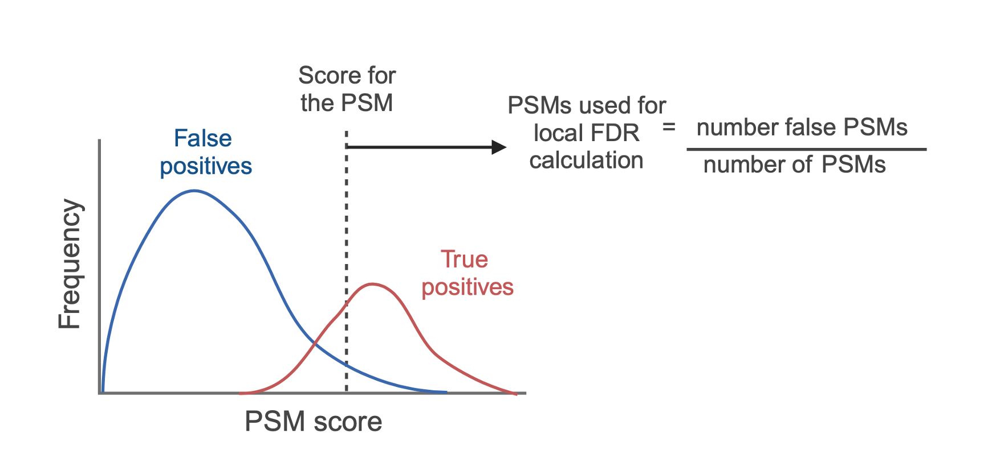

::: {.callout-tip}
#### Learning Objectives

* Be aware of key data cleaning steps which should or could be completed during the processing of expression proteomics data
* Make use of the `filterFeatures` function to conditionally remove data from (i) an entire `QFeatures` object or (ii) specified `experimental assays` of a `QFeatures` object
* Understand the difference between non-specific and data-dependent filtering  
* Be able to explore the feature data stored in the `rowData` and get a feel for how to make your own data-dependent decisions regarding data cleaning
* Understand the importance of dealing with missing values in expression proteomics datasets and be aware of different approaches to doing so

:::

```{r, echo = FALSE, fig.align = "center", out.width = "90%"}
knitr::include_graphics("figs/flow_chart/flow_chart.002.png", error = FALSE)
```


```{r, eval=TRUE, include=FALSE}
library("QFeatures")
library("factoextra")
library("org.Hs.eg.db")
library("clusterProfiler")
library("enrichplot")
library("patchwork")
library("tidyverse")
library("here")

load(here("course_files/preprocessed/lesson02.rda"), verbose = TRUE)
```


Now that we have our PSM level quantitative data stored in a `QFeatures` object,
the next step is to carry out some data cleaning. However, as with all data 
analyses, it is sensible to keep a copy of our raw data in case we need to refer
back to it later. 

## Creating a copy of the raw data 

To create a copy of the `psms_raw` data we can first extract the `experimental assay`
and then add it back to our `QFeatures` object using the `addAssay` function.
When we do this, we give the second `experimental assay` (our copy) a new name. Here we will
call it `psms_filtered` as by the end of our data cleaning and filtering, this
copy will have had the unwanted data removed.

```{r}
## Extract a copy of the raw PSM-level data
raw_data_copy <- cc_qf[["psms_raw"]] 

## Re-add the assay to our QFeatures object with a new name
cc_qf <- addAssay(x = cc_qf, 
                  y = raw_data_copy, 
                  name = "psms_filtered")

## Verify
cc_qf
```

We now see that a second `experimental assay` has been added to the `QFeatures`
object. When we use `addAssay` to add to a `QFeatures` object, the newly created
`experimental assay` does not automatically have links to the pre-existing 
`experimental assay`s. We can use the `assayLink()` function to check which links
exist for `psms_filtered`.


```{r}
## Check which assay links exist for the psms_filtered assay
assayLink(x = cc_qf,
          i = "psms_filtered")
```

As we expected, no links exist. If we wanted to explicitly add links between two
data we could do so using the `addAssayLink` function, as demonstrated below.

```{r}
## Create assay link
cc_qf <- addAssayLink(object = cc_qf, 
                      from = "psms_raw", 
                      to = "psms_filtered",
                      varFrom = "Master.Protein.Accessions",
                      varTo = "Master.Protein.Accessions")

## Verify
assayLink(x = cc_qf,
          i = "psms_filtered")
```

Adding a relation between these two `experimental assays` ensure traceability. We
will learn more about assay links as we progress through this course.

::: {.callout-note}
#### Assay links
`QFeatures` maintains the hierarchical links between quantitative levels whilst
allowing easy access to all data levels for individual features (PSMs, peptides 
and proteins) of interest. This is fundamental to the `QFeatures` 
infrastructure and will be exemplified throughout this course.

:::


## Data cleaning

Now that we have created a copy of our raw data, we can start the process of data 
cleaning. We will only remove data from the second copy of our data, the one
which we have called `"psms_filtered"`. Standard data cleaning steps in proteomics 
include the removal of features which: 

1. *Do not have an associated master protein accession*
2. *Have a (master) protein accession matching to a contaminant protein*
3. *Do not have quantitative data*

The above steps are necessary for all quantitative proteomics datasets, 
regardless of the experimental goal or data level (PSM or peptide). If a feature
cannot be identified and quantified then it does not contribute useful 
information to our analysis. Similarly, contaminant proteins that are introduced
intentionally as reagents (e.g., trypsin) or accidentally (e.g., human keratins)
do not contribute to our biological question as they were not originally present
in the samples.

We also have the option to get rid of any lower quality data by removing those
features which:

4. *Are not rank 1* 
5. *Are not unambiguous*

Since each spectrum can have multiple potential matches (PSMs), the software 
used for our identification search provides some parameters to help us decide
how confident we are in a match. Firstly, each PSM is given a rank based on the
probability of it being incorrect - the PSM with the lowest probability of being 
wrong is allocated rank 1. Secondly, each PSM is assigned a level of ambiguity
to tell us whether it was easy to assign with no other options (unambiguous), 
whether it was selected as the best match from a series of potential matches 
(selected), or whether it was not possible to distinguish between potential 
matches (ambiguous). High quality identifications should be both rank 1 and 
unambiguous. The exact filters we set here would depend on how exploratory or 
stringent we wish to be.

Finally, depending upon the experimental question and goal, we may also wish to
remove features which:

6. *Are not unique*

The information regarding each of these parameters is present as a column in the 
output of our identification search, hence is present in the `rowData` of our
`QFeatures` object. 

::: {.callout-note}
#### Third party software
The use-case data was searched using the [Proteome Discoverer software](https://www.thermofisher.com/uk/en/home/industrial/mass-spectrometry/liquid-chromatography-mass-spectrometry-lc-ms/lc-ms-software/multi-omics-data-analysis/proteome-discoverer-software.html) (Thermo Fisher Scientific). 
This is one among several third party softwares available for protein
identification. Each software has it's own naming conventions, formatting and
metrics for quantitation and associated metadata. As such, users following
this course with their own data should be mindful of this and adapt the 
proposed filters and steps accordingly.

:::


### Non-specific filtering

To remove features based on variables within our `rowData` we make use of the
**`filterFeatures`** function. This function takes a `QFeatures` object as its input
and then filters this object against a condition based on the `rowData` (indicated
by the `~` operator). If the condition is met and returns TRUE for a feature,
this feature will be kept.

The `filterFeatures` function provides the option to apply our filter (i) to the
whole `QFeatures` object and all of its `experimental assays`, or (ii) to specific
assays within the `QFeatures` object. We wish to only filter on the data in our
`QFeatures` object called `psms_filtered` (and not every assay) so in the
following code chunks we always pass the argument `i = "psms_filtered"`.

Let's begin by filtering out any PSMs that **do not have a master protein**.
These instances are characterised by an empty `character` i.e. `""`.

```{r}
## Before filtering
cc_qf

cc_qf <- cc_qf %>% 
  filterFeatures(~ Master.Protein.Accessions != "", i = "psms_filtered")

## After filtering
cc_qf
```

We see a message printed to the screen `"Master.Protein.Accessions' found in 2 out of 2 assay(s)"` this is informing us that the column
`"Master.Protein.Accessions"` is present in the `rowData` of the two 
`experimental assays` in our `QFeatures` object. We can see from looking 
at our `cc_qf` object before and after filtering we have lost several hundred 
PSMs that do not have a master protein.

As mentioned above it is standard practice in proteomics to filter MS data for
**common contaminants**. This is done by using a carefully curated,
sample-specific contaminant database. In this study the data was searched against
the [Hao Group's Protein Contaminant Libraries for DDA and DIA Proteomics](https://github.com/HaoGroup-ProtContLib/Protein-Contaminant-Libraries-for-DDA-and-DIA-Proteomics/)
@Frankenfield2022 during the PD search. The PD software flags PSMs that originate
from proteins that match a contaminant and this is recorded in the "Contaminant"
column in the PD output and propagated to the `rowData` of our `QFeatures`
object.


:::{.callout-exercise}
#### Challenge 1: Filtering for contaminants 


The Proteome Discoverer software flags a potential contaminant in the
`Contaminants` column found in the `rowData` of the `experimental assay`.

we can count how many contaminants there are using,

```{r}
cc_qf[["psms_filtered"]] %>%  
  rowData() %>% 
  as_tibble() %>% 
  count(Contaminant)
```

Examine the `class` of this column,

```{r}
cc_qf[["psms_filtered"]] %>%  
  rowData() %>% 
  as_tibble() %>% 
  pull(Contaminant) %>% 
  class()
```

Careful: it is not a `logical` TRUE or FALSE. It is a `character` and takes
two values, `"True"` or `"False"`. 

1. Use the `filterFeatures` function on the `psms_filtered` experimental assay 
and filter out any contaminants which have been flagged as `"True"`.

2. How many PSMs are left after this step?

::: {.callout-answer collapse=true}

```{r}
cc_qf <- cc_qf %>% 
  filterFeatures(~ Contaminant != "True", i = "psms_filtered")

## After filtering
cc_qf
```

We now have `r nrow(cc_qf[[2]])` PSMs.

:::
:::

::: {.callout-note}
#### More on contaminants
It is also possible to filter against your own contaminants list uploaded into
R. It may be that you have a second list or newer list you'd like to search
against, or you perhaps did not add a contaminants list to filter against in the
identification search (which was performed in third party software). Full
details including code can be found in @Hutchings2023.

Note: Filtering on “Protein.Accessions”, rather than "Master.Protein.Accessions"
ensures the removal of PSMs which matched to a protein group containing a
contaminant protein, even if the contaminant protein is not the group’s master
protein.

:::


One of the next filtering steps is to examine to see if we have any **PSMs which lack quantitative data**. In outputs derived from Proteome Discoverer this
information is included in the “Quan.Info” column where PSMs are annotated as
having “NoQuanLabels”. For users who have considered both lysine and N-terminal TMT labels as static modifications, the data should not contain any PSMs without quantitative information. See @Hutchings2023 for how to filter your data if you have TMT modifications set as dynamic.

```{r}
cc_qf[["psms_filtered"]] %>%
  rowData() %>% 
  as_tibble() %>%
  pull(Quan.Info) %>%
  table()
```

We see we have no annotation in this column and no PSMs lacking quantitative information.


:::{.callout-exercise}
#### Challenge 2: PSM ranking


Since individual spectra can have multiple candidate PSMs, Proteome Discoverer
uses a scoring algorithm to determine the probability of a PSM being incorrect.
Once each candidate PSM has been given a score, the one with the lowest score
(lowest probability of being incorrect) is allocated rank 1. The PSM with the
second lowest probability of being incorrect is rank 2, and so on. For the
analysis, we only want rank 1 PSMs to be retained. The majority of search
engines, including SequestHT (used in this analysis), also provide their own PSM
rank. To be conservative and ensure accurate quantitation, we also only retain
PSMs that have a search engine rank of 1.

1. Find the columns `Rank` and `Search.Engine.Rank` in the dataset and tabulate 
how many PSMs we have at each level

2. Use `filterFeatures` and keep,
* PSMs with a `Rank` of 1
* PSMs with a `Search.Engine.Rank` of 1
* High confidence PSMs that have been unambiguously assigned

::: {.callout-answer collapse=true}

**Part 1**

First let's examine the columns in the `rowData`

```{r}
cc_qf[["psms_filtered"]] %>%
  rowData() %>% 
  names()
```

Let's examine the columns `Rank` and `Search.Engine.Rank`,

```{r}
cc_qf[["psms_filtered"]] %>%
  rowData() %>% 
  as_tibble() %>%
  count(Rank)

cc_qf[["psms_filtered"]] %>%
  rowData() %>% 
  as_tibble() %>%
  count(Search.Engine.Rank)
```

We can also visualise this by piping the results to `ggplot`

```{r}
cc_qf[["psms_filtered"]] %>%
  rowData() %>% 
  as_tibble() %>%
  count(Rank) %>% 
  ggplot(aes(Rank, n)) + 
  geom_col() + 
  scale_y_log10() 

cc_qf[["psms_filtered"]] %>%
  rowData() %>% 
  as_tibble() %>%
  count(Search.Engine.Rank) %>% 
  ggplot(aes(Search.Engine.Rank, n)) + 
  geom_col() + 
  scale_y_log10() 
```

**Part 2**

Now let's keep only PSMs with a rank of 1,

```{r}
cc_qf <- cc_qf %>% 
  filterFeatures(~ Rank == 1, i = "psms_filtered") %>%
  filterFeatures(~ Search.Engine.Rank == 1, i = "psms_filtered") %>%
  filterFeatures(~ PSM.Ambiguity == "Unambiguous", i = "psms_filtered") 

## After filtering
cc_qf
```

We now have `r nrow(cc_qf[[2]])` PSMs.

:::
:::

In quantitative proteomics when thinking about what PSMs to consider for take 
forward for quantitation we consider **PSM uniqueness**. By definition uniqueness
in this context refers to (i) PSMs corresponding to a single protein only, or it
can also refer to (ii) PSMs that map to multiple proteins within a single protein 
group. This distinction is ultimately up to the user. We do not consider PSMs 
corresponding to razor and shared peptides as these are linked to multiple 
proteins across multiple protein groups.

In this workflow, the final grouping of peptides to proteins will be done based
on master protein accession. Therefore, differential expression analysis will 
be based on protein groups, and we here consider unique as any PSM linked to 
only one protein group. This means removing PSMs where “Number.of.Protein.Groups” 
is not equal to 1.

```{r}
cc_qf <- cc_qf %>% 
  filterFeatures(~ Number.of.Protein.Groups == 1, i = "psms_filtered")

## After filtering
cc_qf
```


### Addititional quality control filters available for TMT data

```{r, echo = FALSE, fig.align = "center", out.width = "90%"}
knitr::include_graphics("figs/flow_chart/flow_chart.003.png", error = FALSE)
```


As well as the completion of standard data cleaning steps which are common to 
all quantitative proteomics experiments (see above), different experimental 
methods are accompanied by additional data processing considerations. Although
we cannot provide an extensive discussion of all methods, we will draw attention
to three key quality control parameters to consider for our use-case TMT data. 

1. Average reporter ion signal-to-noise (S/N)

The quantitation of a TMT experiment is dependent upon the measurement of 
reporter ion signals from either the MS2 or MS3 spectra. Since reporter ion
measurements derived from a small number of ions are more prone to stochastic
ion effects and reduced quantitative accuracy, we want to remove PSMs that rely 
such quantitation to ensure high data quality. When using an orbitrap analyser, 
the number of ions is proportional to the S/N ratio of a peak. Hence, removing
PSMs that have a low S/N value acts as a proxy for removing low quality
quantitation. 

2. Isolation interference (%)

Isolation interference occurs when multiple TMT-labelled precursor peptides are
co-isolated within a single data acquisition window. All co-isolated peptides go
on to be fragmented together and reporter ions from all peptides contribute to
the reporter ion signal. Hence, quantification for the identified peptide becomes
inaccurate. To minimise the co-isolation interference problem observed at MS2,
MS3-based analysis can be used @McAlister2014. Nevertheless, we remove PSMs with 
a high percentage isolation interference to prevent the inclusion of inaccurate 
quantitation values.

3. Synchronous precursor selection mass matches (%) - SPS-MM

SPS-MM is a parameter unique to the Proteome Discoverer software which lets users
quantify the percentage of MS3 fragments that can be explicitly traced back to
the precursor peptides. This is important given that quantitation is based on
the MS3 spectra.

Here we will apply the default quality control thresholds as suggested by 
Thermo Fisher and keep features with:

* Average reporter ion S/N >= 10
* Isolation interference < 75%
* SPS-MM >= 65%

We also remove features that do not have information regarding these quality
control parameters i.e., have an NA value in the corresponding columns of the
`rowData`. To remove these features we include the `na.rm = TRUE` argument.


```{r}
cc_qf <- cc_qf %>% 
  filterFeatures(~ Average.Reporter.SN >= 10, 
                 na.rm = TRUE, i = "psms_filtered") %>%
  filterFeatures(~ Isolation.Interference.in.Percent <= 75, 
                 na.rm = TRUE, i = "psms_filtered") %>%
  filterFeatures(~ SPS.Mass.Matches.in.Percent >= 65, 
                 na.rm = TRUE, i = "psms_filtered")
```


In reality, we advise that users take a look at their data to decide whether the
default quality control thresholds applied above are appropriate. If there is
reason to believe that the raw MS data was of lower quality than desired, it
may be sensible to apply stricter thresholds here. Similarly, if users wish to 
carry out a more stringent or exploratory analyses, these thresholds can be 
altered accordingly. For code and more information please see @Hutchings2023.


### Controlling false discovery rate (FDR)

```{r, echo = FALSE, fig.align = "center", out.width = "90%"}
knitr::include_graphics("figs/flow_chart/flow_chart.004.png", error = FALSE)
```


The data cleaning steps that we have carried out so far have mainly been 
concerned with achieving high quality quantitation. However, we also want to be
confident in our PSMs and their corresponding peptide and protein identifications.

To identify the peptides present in each of our samples we used a third party 
software to carry out a database search. Raw MS spectra are matched to theoretical 
spectra that are generated via *in silico* digestion of our desired protein 
database. The initial result of this search is a list of peptide spectrum matches,
PSMs. A database search will identify PSMs for the majority of MS spectra, but
only a minority of these will be true positives. In the same way that experiments 
must be conducted with controls, database search identifications need to be 
statistically validated to avoid false positives. The most widely used method
for reducing the number of false positive identifications is to control the
false discovery rate (FDR).


#### Target-decoy approach to FDR control {-}

The most common approach to FDR control is the target-decoy approach. This 
involves searching the raw MS spectra against both a target and decoy database.
The target database contains all protein sequences which could be in our sample
(the human proteome and potential contaminants). The decoy database contains 
fake proteins that should not be present in the sample. For example, a decoy
database may contain reversed or re-shuffled sequences. The main principle is 
that by carrying out these two searches we are able to estimate the the 
proportion of total PSMs that are false (matched to the decoy sequences) and
apply score-based thresholding to shift this false discovery rate to a 
desired maximum. Typically expression proteomics utilises a maximum FDR of 0.01 
or 0.05, that is to say 1% or 5% of PSMs are accepted false positives. 


#### PSM level local FDR {-}

The first FDR to be calculated is that for the PSMs themselves, often referred to
as **local FDR**. As mentioned previously, each PSM is given a score indicating
how likely it is to be correct or incorrect, depending on the search engine used.
Based on these scores, each candidate PSM is ranked such that rank 1 PSMs have
the highest probability of being correct or lowest probability of being incorrect.
To calculate the local FDR for a PSM, the score for that PSM is taken as a 
threshold, and all PSMs with a score equal to or better than that PSM are extracted.
The proportion of false positives within this population of PSMs is taken as its
local FDR. In this way, the FDR can be thought of as the proportion of false 
positives above the critical score threshold. 


```{r fdr_figure, echo = FALSE, fig.align = "center", out.width = "50%", fig.cap = "An illustration of the local FDR calculation used to assign each PSM an FDR."}

```


In the parameters for our identification search using Proteome Discoverer we
specified a PSM level FDR threshold. We did this by allocating PSM confidence
levels as 'high', 'medium' or 'low' depending on whether their FDR was < 0.01, 
< 0.05 or > 0.05. We then told Proteome Discoverer to only retain high 
confidence PSMs, those with a local FDR < 0.01. The local FDR indirectly tells
us the probability of a PSM being a false positive, given the score it has.

Let's double check that we only have high confidence PSMs.

```{r}
cc_qf[["psms_raw"]] %>%
  rowData() %>%
  as_tibble() %>%
  pull(Confidence) %>%
  table()
```

As expected, all of the PSMs in our data are of high confidence. 

#### Protein level FDR thresholding is still required {-}

Although we have already applied a PSM level FDR threshold to the data (during
the identification search), it is highly recommended to set a protein level FDR
threshold. This is because each peptide can have multiple PSMs and each protein
can be supported by multiple peptides, thus resulting in the potential for
amplification of the FDR during data aggregation. At a given PSM level score
threshold, the peptide level FDR is greater than the PSM level FDR. Similarly,
the protein level FDR is greater than the peptide level FDR.

To be absolutely confident in our final protein data we need to apply a protein
level FDR. Unfortunately, third party software typically generates output tables
in a sequential manner and there is currently no way to include information
about the protein level FDR in the PSM level output. Therefore, we have to
import the protein level output to get this information. The file is called
`cell_cycle_total_proteome_analysis_Proteins.txt`. 

We begin by using the `read.delim` function to read in the data,


```{r}
## Applying protein level FDR - import protein output from database search
protein_data_PD <- read.delim(file = "data/cell_cycle_total_proteome_analysis_Proteins.txt")
```

Let's check the dimensions of the protein level output,

```{r}
dim(protein_data_PD)
```

The output contains `r nrow(protein_data_PD)` proteins. Let's compare this to the
number of master protein accessions in our raw and filtered PSM data,

```{r}
## Number of master proteins in our raw data
cc_qf[["psms_raw"]] %>%
  rowData() %>%
  as_tibble() %>%
  pull(Master.Protein.Accessions) %>%
  unique() %>%
  length()

## Number of master proteins in our filtered data
cc_qf[["psms_filtered"]] %>%
  rowData() %>%
  as_tibble() %>%
  pull(Master.Protein.Accessions) %>%
  unique() %>%
  length()
```

It looks like the protein level output has fewer proteins than the raw PSM file
but more proteins than our filtered PSM data. This tells us that Proteome 
Discoverer has done some filtering throughout the process of aggregating from 
PSM to peptide to protein, but not as much filtering as we have done manually in 
R. This makes sense because we did not set any quality control thresholds on 
co-isolation interference, reporter ion S/N ratio or SPS-MM during the search.

Now let's look to see where information about the protein level FDR is stored.

```{r}
names(protein_data_PD) %>% 
  head(10)
```

We have a column called `"Protein.FDR.Confidence.Combined"`. Let's add this 
information to our `rowData` of the `psms_filtered` experimental assay of our `QFeatures` 
object. 

First let's extract the `rowData` and convert it to a `data.frame` so we can 
make use of `dplyr`,

```{r}
## Extract the rowData and convert to a data.frame
psm_data_QF <- 
  cc_qf[["psms_filtered"]] %>% 
  rowData() %>% 
  as.data.frame()
```

Now let's subset the `protein_data_PD` data to keep only accession and 
FDR information,

```{r}
## Select only the Accession and FDR info
protein_data_PD <- 
  protein_data_PD %>% 
  select(Accession, Protein.FDR.Confidence.Combined)
```

Now let's use `dplyr` and the `left_join` function to do the matching
between the protein PD data and our PSM data for us. We need to specify how
we join them so we need to specify the argument 
`by = c("Master.Protein.Accessions" = "Accession")` to tell R we wish to 
join the two datasets by their protein Accessions. Note, in the `rowData` of
the `QFeatures` object we have `"Master.Protein.Accessions"` and in the PD 
protein data the column is just called `"Accessions"`. Check with your own data
the explicit naming of your data files as this will differ between third party 
softwares.

```{r}
## Use left.join from dplyr to add the FDR data to PSM rowData data.frame 
fdr_confidence <- left_join(x = psm_data_QF,  
                            y = protein_data_PD,
                            by = c("Master.Protein.Accessions" = "Accession")) %>% 
  pull("Protein.FDR.Confidence.Combined")
```

::: {.callout-note}
#### Joining data.frames
Note: when using `left_join` we specify the argument `by =
c("Master.Protein.Accessions" = "Accession"))` (note the = equals sign between
the names). This tells `left_join` we want to match join the two `data.frames`
by matching accession numbers between the the `Master.Protein.Accessions` column
in `psm_data_QF` and the column called `Accession` in the `protein_data_PD`
data.
:::

Now let's add the FDR information back to the `QFeatures` object,

```{r}
## Now add this data to the QF object
rowData(cc_qf[["psms_filtered"]])$Protein.FDR.Confidence <- fdr_confidence
```

Now we can print a table to see how many of the PSMs in our data were found
to have a high confidence after protein level FDR calculations.

```{r}
cc_qf[["psms_filtered"]] %>%
  rowData() %>% 
  as_tibble() %>% 
  pull(Protein.FDR.Confidence) %>%
  table()
```

Most of the PSMs in our data were found to originate from proteins with high 
confidence (FDR < 0.01 at protein level), but there are a few that are medium 
or low confidence. Even though we set a PSM level FDR threshold of 0.01, some
of the resulting proteins still exceed this FDR due to amplification of error
during aggregation. 

We can now use the `filterFeatures` function to remove PSMs that do not have a
`Protein_Confidence` of 'High'.

```{r}
cc_qf <- cc_qf %>%
  filterFeatures(~ Protein.FDR.Confidence == "High", 
                 i = "psms_filtered")
```

Notice, we see a message output to the terminal after running the function that 
telling us that `Protein.FDR.Confidence` was only found in 1 of our experiment 
assays and as such no filter was applied to the raw data. This is correct and 
expected.

```{r}
cc_qf[["psms_filtered"]] %>%
  rowData %>%
  as_tibble %>%
  pull(Protein.FDR.Confidence) %>%
  table()
```

For more information about how FDR values are calculated and used see @Prieto2019.

## Management of missing data 

```{r, echo = FALSE, fig.align = "center", out.width = "90%"}
knitr::include_graphics("figs/flow_chart/flow_chart.005.png", error = FALSE)
```


Having cleaned our data, the next step is to deal with missing values. It is 
important to be aware that missing values can arise for different reasons in 
MS data, and these reasons determine the best way to deal with the missing data.

* Biological reasons - a peptide may be genuinely absent from a sample or have such low abundance that it is below the limit of MS detection
* Technical reasons - technical variation and the stocastic nature of MS (particularly using DDA) may lead to some peptides not being quantified. Some peptides have a lower ionization efficiency which makes them less compatible with MS analysis

Missing values that arise for different reasons can generally be deciphered by 
their pattern. For example, peptides that have missing quantitation values for
biological reasons tend to be low intensity or completely absent peptides. Hence,
these missing values are **missing not at random (MNAR)** and appear in an
intensity-dependent pattern. By contrast, peptides that do not have quantitation
due to technical reasons are **missing completely at random (MCAR)** and appear
in an intensity-independent manner.


### Influence of experimental design  

All quantitative proteomics datasets will have some number of missing values, 
although the extent of data missingness differs between label-free and label-based
DDA experiments as well as between DDA and DIA label-free experiments. 

When carrying out a label-free DDA experiment, all samples are analysed via 
independent MS runs. Since the selection of precursor ions for fragmentation is
somewhat stochastic in DDA (e.g., top *N* most abundant precursors are selected)
experiments, different peptides may be identified and quantified across the 
different samples. In other words, not all peptides that are analysed in one 
sample will be analysed in the next, thus introducing a high proportion of 
missing values.

One of the advantages of using TMT labelling is the ability to multiplex samples
into a single MS run. In the use-case, 10 samples were TMT labelled and pooled
together prior to DDA MS analysis. As a result, the same peptides were quantified
for all samples and we expect a lower proportion of missing values than if we
were to use label-free DDA. 

More recently, DIA MS analysis of label-free samples has increased in popularity.
Here, instead of selecting a limited number of precursor peptides (typically the
most abundance) for subsequent fragmentation and analysis, all precursors within
a selected *m/z* window are selected. The analysis of all precursor ions within
a defined range in every run results in more consistent coverage and accuracy
than DDA experiments, hence lower missing values.


### Exploration of missing data

The management of missing data can be considered in three main steps:

1. Exploration of missing data - determine the number and pattern of missing values
2. Removal of data with high levels of missingness - this could be features with missing values across too many samples or samples with an abnormally high proportion of missingness compared to the average
3. Imputation (optional)

::: {.callout-note}
#### Encoding of missing data
Before we begin managing the missing data, we first need to know what missing data
looks like. In our data, missing values are notated as `NA` values. Alternative 
software may display missing values as being zero, or even infinite if 
normalisation has been applied during the database search. All functions used for
the management of missing data within the `QFeatures` infrastructure use the `NA` 
notation. If we were dealing with a dataset that had an alternative encoding, we
could apply the `zeroIsNA()` or `infIsNA()` functions to convert missing values
into `NA` values.

:::

The main function that facilitates the exploration of missing data in `QFeatures`
is `nNA`. Let's try to use this function. Again, we use the `i = ` argument to
specify which assay within the `QFeatures` object that we wish to look at. 

```{r}
nNA(cc_qf, i = "psms_filtered")
```

The output from this function is a `list` of three `DFrame`s. The first of
these (called `nNA`) gives us information about missing data at the global level
(i.e., for the entire experimental assay). We get information about the absolute number of
missing values (`nNA`) and the proportion of the total data set that is missing
values (`pNA`). The next two data frames also give us `nNA` and `pNA` but this
time on a per row/feature (`nNArows`) and per column/sample (`nNAcols`) basis.

Let's direct the output of `nNA` on each `experimental assay` to an object,

```{r}
mv_raw <- nNA(cc_qf, i = "psms_raw")
mv_filtered <- nNA(cc_qf, i = "psms_filtered")
```

To access one `DataFrame` within a list we use the standard `$` operator, 
followed by another `$` operator if we wish to access specific columns.

**Missing values down columns (sample)**
Print information regarding the number of missing values per column in
the `"mv_raw"` data,

```{r}
mv_raw$nNAcols
```

and after filtering,

```{r}
mv_filtered$nNAcols
```

Now, we can extract the proportion of NAs in each sample,

```{r}
mv_raw$nNAcols$pNA
```

We can also pass the output data from `nNA` to `ggplot` to visualise the missing
data. This is particularly useful so that we can see whether any of our samples
have an abnormally high proportion of missing values compared to the average. This
could be the case if something had gone wrong during sample preparation. It is 
also useful to see whether there is any specific conditions that have a greater
number of missing values.

In the following code chunk we visualise the proportion of missing values per 
sample and check for sample and condition bias. 

In the raw data,

```{r}
mv_raw$nNAcols %>%
  as_tibble() %>%
  mutate(condition = colData(cc_qf)$condition) %>%
  ggplot(aes(x = name, y = pNA, group = condition, fill = condition)) +
  geom_bar(stat = "identity") +
  labs(x = "Sample", y = "Proportion issing values") + 
  theme_bw()
```

In the filtered data,

```{r}
mv_filtered$nNAcols %>%
  as_tibble() %>%
  mutate(condition = colData(cc_qf)$condition) %>%
  ggplot(aes(x = name, y = pNA, group = condition, fill = condition)) +
  geom_bar(stat = "identity") +
  labs(x = "Sample", y = "Proportion missing values") +
  theme_bw()
```


::: {.callout-note}
#### Missing values - expectations
In this experiment we expect all samples to have a low proportion of missing 
values due to the TMT labelling strategy. We also expect that all samples should
have a similar proportion of missing values because we do not expect cell cycle
stage to have a large impact on the majority of the proteome. Hence, the samples
here should be very similar. This is the case in most expression proteomics
experiments which aim to identify differential protein abundance upon a cellular
perturbation. However, in some other MS-based proteomics experiments this would
not be the case. For example, proximity labelling and co-immunoprecipitation 
(Co-IP) experiments have control samples that are not expected to have any proteins
in, although there is always a small amount of unwanted noise. In such cases it 
would be expected to have control samples with a large proportion of missing
values and experimental samples with a much lower proportion. It is important to
check that the data corresponds to the experimental setup.

:::


**Missing values across rows (PSMs)**
Print information regarding the number of missing values per row (PSM):

In the `"psms_raw"` data,

```{r}
mv_raw$nNArows
```

The `"psms_filtered"` data,

```{r}
mv_filtered$nNArows
```


:::{.callout-exercise}
#### Challenge 3: Analysing missing values


How many PSMs do we have with (i) 0 missing values, (ii) 1 missing value, (iii) 
2 or more missing values, across samples, before and after filtering?

::: {.callout-answer collapse=true}


The `nNA` column gives information on the number missing values (or we can 
use `pNA` which gives information on the proportion of missing values). Calling `table` on the
output number of missing values we have across samples,

On the raw data,
```{r}
mv_raw$nNArows$nNA %>% table()
```

On the filtered data,
```{r}
mv_filtered$nNArows$nNA %>% table()
```

:::
:::


<!-- **TODO - add second challenge or too tricky?** -->
<!-- Ideas ... -->
<!-- Something to do with missing data across rows - prior to filtering based on a  -->
<!-- feature having >20% missing values. Ask them to work out how many this will be? -->
<!-- Ask them to work out the max and min number of missing values per feature? -->
<!-- Ask them to create a plot looking at the number of missing values across the -->
<!-- intensity distribution (are they intensity dependent or independent?) -->


### Removing data with high levels of missingness

Although the use-case data has only a small number of mssing values it is still
common to remove individual features that have too many missing values across
samples. Here, we remove PSMs that have >20% missing values. This is done using
the `filterNA` function where the `pNA` argument specifies the maximum proportion
of missing values to allow per feature.


```{r}
cc_qf <- cc_qf %>%
  filterNA(pNA = 0.2, i = "psms_filtered")
```


We already established that none of our samples have an abnormally high 
proportion of missing values (relative to the average). Therefore, we do not
need to remove any entire samples/columns.


### Imputation of remaining missing values

The final step in managing our missing data is to consider whether to impute.
Imputation involves the replacement of missing values with probable values.
Unfortunately, estimating probable values is difficult and requires complex 
assumptions about why a value is missing. For example, if a value is missing 
because a peptide is completely absent or present at an abundance below the limit
of detection then the most suitable replacement value is arguably the lowest
abundance value recorded in the data set (since this represents the limit of
detection). Alternatively, if a value is missing because of stochastic technical
reasons then it might be more appropriate to replace it with a value derived 
from a similar peptide. Overall, left-censored methods such as minimal value and
limit of detection approaches work best for data that is MNAR (intensity-dependent
missing values). Hot deck methods such as k-nearest neighbors, random forest and 
maximum likelihood methods work better for data that is MCAR (intensity-independent).
To confuse the situation further, most data sets contain missing values that are
a mixture of MNAR and MCAR, so mixed imputation methods can be applied.

Given that imputation is difficult to get right and can have substantial effects
on the results of downstream analysis, it is generally recommended to avoid
it where we can. This means that if there is not a large proportion of missing
values in our data, we should not impute. 

We can now check to see how many missing values remain in the data.

```{r}
nNA(cc_qf[["psms_filtered"]])$nNA
```

We only have `r nNA(cc_qf[["psms_filtered"]])$nNA$pNA * 100`% missing values in our
data, so imputation is not really necessary here. We could either remove the 
PSMs that still have missing values or continue our analysis. The latter is 
possible since missing values are often lost during aggregation and there are
now aggregation methods that are able to deal with missing data @Goeminne2020 @Sticker2020.

For demonstration purposes we will carry out imputation anyway. Since we are 
only imputing `r nNA(cc_qf[["psms_filtered"]])$nNA$nNA` values we do not expect
a large effect on the data structure or downstream analysis.

Imputation within the `QFeatures` infrastructure is completed using the `impute`
function. To see what imputation methods this function facilitates we can use
`MsCoreUtils::imputeMethods()`.

To see what imputation methods are available,

```{r}
MsCoreUtils::imputeMethods()
```


Here we will use the baseline k-nearest neighbors (k-NN),

```{r, results = "hide", warning=FALSE, message=FALSE}
cc_qf <- impute(object = cc_qf,
                method = "knn", 
                i = "psms_filtered",
                name = "psms_imputed")

cc_qf
```

:::{.callout-exercise}
#### Challenge 4: Imputation


Use the `nNA` function to check that the `impute` function has worked.

::: {.callout-answer collapse=true}

Call `nNA` on the `"psms_imputed"` assay.

```{r}
mv_imputed <- nNA(cc_qf[["psms_imputed"]])

## View object
mv_imputed
```

Examine the number of NAs across the rows (PSMs).

```{r}
mv_imputed$nNArows$nNA %>% table()
```

Now down the columns (samples).

```{r}
mv_imputed$nNAcols$nNA %>% table()
```

:::
:::


```{r, include=FALSE}
save(cc_qf, file = here("course_files/preprocessed/lesson03.rda"))
```

::: {.callout-tip}
#### Key Points

- The `filterFeatures` function can be used to remove data from a `QFeatures` object (or an `experimental assay` within a `QFeatures` object) based on filtering parameters within the `rowData`.
- Data processing includes (i) standard proteomics data cleaning steps e.g., removal of contaminants, and (ii) data-specific quality control filtering e.g., co-isolation interference thresholding for TMT data.
- The management of missing quantitative data in expression proteomics data is complex. The `nNA` function can be used to explore missing data and the `filterNA` function can be used to remove features with undesirably high levels of missing data. Where imputation is absolutely necessary, the `impute` function exists within the `QFeatures` infrastructure.
- Protein level thresholding on false discovery rate is required to ensure confident identifications.

:::

## References {-}
